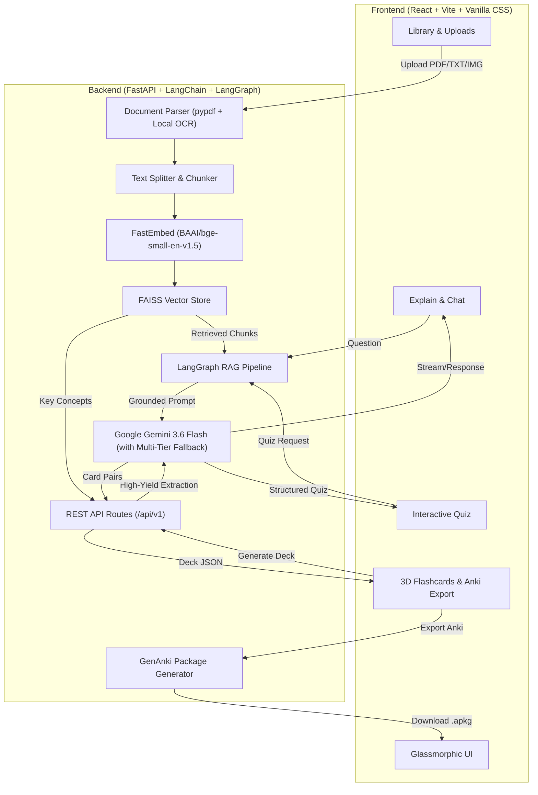

# 🧠 AI Study Assistant — Grounded Multimodal RAG & Study Companion

[](https://ai-study-assistant-coy7.onrender.com/)

[](https://fastapi.tiangolo.com)
[](https://react.dev)
[](https://vitejs.dev)
[](https://ai.google.dev)
[](https://qdrant.github.io/fastembed/)
[](https://github.com/facebookresearch/faiss)

> 🔗 **Live Application URL**: [https://ai-study-assistant-coy7.onrender.com/](https://ai-study-assistant-coy7.onrender.com/)

An intelligent, full-stack AI Study Assistant built for students and researchers. Transform textbooks, lecture slides, research papers, notes, and diagrams into an interactive knowledge base with grounded Q&A, automatic practice quizzes, and interactive 3D flashcards with 1-click **Anki (.apkg)** and **CSV** exports.

---

## 🌟 Key Features

- **📚 Multimodal Document Ingestion**: Upload PDFs, text files, notes, and diagrams. Ingestion and vector chunking run **100% locally and offline** without consuming external API rate limits.
- **🔒 Anonymous Session Isolation**: Individual users visiting the live URL automatically receive their own private, isolated workspace and document library without needing to log in.
- **⚡ High-Speed Local Embeddings (FastEmbed)**: Uses `BAAI/bge-small-en-v1.5` via ONNX Runtime for ultra-fast, zero-cost, CPU-optimized vector embeddings.
- **💬 Grounded Concept Explanations & Summaries**: Ask complex questions across single or all indexed documents. Answers are grounded in the source text with verifiable source chunk citations.
- **🎯 Interactive Practice Quiz Generator**: Auto-generates 5-question multiple-choice quizzes with explanations and instant scoring.
- **🗂️ Interactive 3D Flashcards & Anki Export**:
  - Interactive 3D flip card practice in the browser with keyboard shortcuts (Space to flip, Left/Right arrows to cycle).
  - **📥 One-Click Anki Export (`.apkg`)**: Downloads native Anki decks with dark-mode styling importable directly into the Anki app.
  - **📄 CSV Export**: Download 3-column spreadsheet decks for Quizlet, Notion, or RemNote.
- **🛡️ Multi-Model Auto-Fallback Engine**: Cascades across available Gemini model tiers if rate limits are encountered, preventing service interruptions.
- **✨ Premium Glassmorphic UI**: Fast, responsive dark interface with clean Markdown typography, source drawers, live indexing badges, and single-click document removal.

---

## 🏗️ Architecture Overview



---

## 🚀 Quick Start (Local Development)

### Prerequisites
- Python 3.10+
- Node.js 18+ & npm
- Google Gemini API Key ([Get one free at Google AI Studio](https://aistudio.google.com/))

---

### 1. Clone & Configure Environment

```bash
git clone https://github.com/rn-harsh04/AI-Study-Assistant.git
cd AI-Study-Assistant

# Create backend environment configuration
cat <<EOF > backend/.env
GEMINI_API_KEY=your_gemini_api_key_here
GEMINI_CHAT_MODEL=gemini-3.6-flash
GEMINI_EMBEDDING_MODEL=BAAI/bge-small-en-v1.5
EOF
```

---

### 2. Run the Backend (FastAPI)

```bash
cd backend
python3 -m venv venv
source venv/bin/activate  # On Windows: venv\Scripts\activate
pip install -r requirements.txt

# Start FastAPI server on port 8000
uvicorn app.main:app --reload --port 8000
```
Backend API will be live at `http://127.0.0.1:8000` with interactive docs at `http://127.0.0.1:8000/docs`.

---

### 3. Run the Frontend (React + Vite)

```bash
cd ../frontend
npm install
npm run dev
```
Open `http://localhost:5173` in your browser.

---

## 🐳 Docker Deployment

You can run the entire full-stack application inside a single production-ready multi-stage Docker container:

```bash
# Build Docker image
docker build -t studyassistant .

# Run container
docker run -p 8000:8000 -e GEMINI_API_KEY="your_api_key_here" studyassistant
```

Access the app at `http://localhost:8000`.

---

## ☁️ Deploying to Render

This repository includes a native `Dockerfile` and `render.yaml` configuration for 1-click deployment on Render:

1. Push this repository to GitHub.
2. In [Render Dashboard](https://dashboard.render.com/):
   - Click **New +** ➔ **Web Service**.
   - Connect your `AI-Study-Assistant` repository.
   - Runtime: **Docker** (Root directory: `.`).
   - Add Environment Variable:
     - `GEMINI_API_KEY`: *(Your Google AI Studio API Key)*
3. Click **Deploy Web Service**. Render builds the React frontend, packages the Python backend with FastEmbed & FAISS, and serves the full-stack app on a public HTTPS URL.

---
## LIVE LINK
https://ai-study-assistant-coy7.onrender.com/
## 🧪 Testing

Run the automated test suite covering health checks, document indexing, RAG retrieval, quiz generation, flashcard creation, and Anki/CSV exports:

```bash
cd backend
PYTHONPATH=. ./venv/bin/python tests/test_api.py
```

---

## 📄 License
MIT License. Built for education and research.
